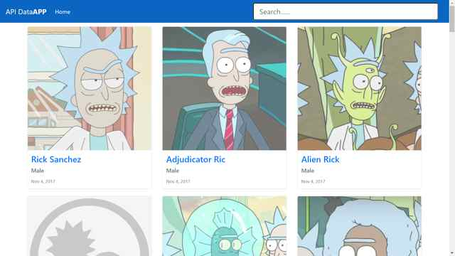

# :zap: Angular Bootstrap API

* Simple responsive app to fetch API data and display it using RxJS observables and infinite-scrolling
* Code from [DominiCode, in Spanish](https://www.youtube.com/channel/UC3QuZuJr2_EOUak8bWUd74A) - see [Inspiration](#inspiration) below, with my modifications
* **Note:** to open web links in a new window use: _ctrl+click on link_


## :page_facing_up: Table of contents

* [General info](#general-info)
* [Screenshots](#screenshots)
* [Technologies](#technologies)
* [Setup](#setup)
* [Features](#features)
* [Status](#status)
* [Inspiration](#inspiration)
* [Contact](#contact)

## :books: General info

* Displays list of API data on Bootstrap cards
* Clicking on a card displays more details about the data item
* Infinite scrolling with button to go back to the top of the page

## :camera: Screenshots



## :signal_strength: Technologies

* [Angular framework v12](https://angular.io/)
* [Bootstrap v5](https://getbootstrap.com/)
* [jQuery v4](https://jquery.com/download/) required by Bootstrap.
* [ngx-infinite-scroll v10](https://www.npmjs.com/package/ngx-infinite-scroll)
* [@popperjs/core v2](https://www.npmjs.com/package/@popperjs/core) Tooltip & Popover Positioning Engine

## :floppy_disk: Setup - Frontend

* Install dependencies using `npm i`
* Run `ng serve` for a dev server. Frontend will open at `http://localhost:4200/` - refreshes on code changes
* Run `npm run lint` to lint test entire codebase using TSLint.
* Run `firebase deploy` to deploy to Google Firebase Hosting
* Run `npm outdated` to see if any npm dependencies are outdated.

## :wrench: Testing

* Run `ng test` to run Jasmine unit tests via [Karma](https://karma-runner.github.io)
* Run `ng e2e` to execute the end-to-end tests via [Protractor](http://www.protractortest.org/).

## :computer: Code Examples (by DominiCode - see [Inspiration](#inspiration) below)

* extract from `form-search.component.ts` to navigate to character-list page where the page initialisation includes a function to search for all characters matching the query.

```typescript
// navigate to character list with query to be used in page initialisation
  onSearch(value: string): void {
    if (value && value.length > 3) {
      this.router.navigate(['/character-list'], {
        queryParams: { q: value },
      });
    }
  }
```

## :cool: Features

* [http data handling best practices](https://angular.io/guide/http) followed - i.e. use of separate service file to get API data then use of subscription callback function in component to subscribe to Observable data using take(1) operator. Character part of response object type defined using an interface model. Interface passed as type parameter to the HttpClient.get() method and RxJS map operator used to transform response data. Transformed data passed to async pipe.
* [Angular Activated Route snapshot params](https://angular.io/api/router/ActivatedRoute) used to pass username from github user search page to github repo display page.
* Use of handleHttpError function to return a more user-friendly error Observable
* custom paths added to `tsconfig.json` to make quoted paths in app more readable, e.g. '@shared/*": ["src/app/shared/*"]'

## :clipboard: Status, Testing & To-Do List

* Status: Working. Updated may 2021
* Testing: all files pass linting. No unit or end-to-end tests added by myself.
* To-Do: fix menu toggle, improve lighthouse score. Add unit testing

## :clap: Inspiration/General Tools

* [Domini Code: Consumiendo API REST - Angular 10 - Rick and Morty API](https://www.youtube.com/watch?v=hGU2ceM8aVY)
* [Domini Code: Como convertir una app en Angular 10 a PWA](https://www.youtube.com/watch?v=jI0eR95U0Z0)
* [Domini Code: #programadores #angular #aprenderAngular #desarrolloWeb HttpHandler - ANGULAR 10](https://www.youtube.com/watch?v=-x_tQKNOpzI)
* [Ricky & Morty documentation](https://rickandmortyapi.com/documentation/)
* [Logrocket: 5 tricks to eliminate render blocking resources](https://blog.logrocket.com/5-tricks-to-eliminate-render-blocking-resources/)

## :envelope: Contact

* Repo created by [ABateman](https://www.andrewbateman.org) - you are welcome to [send me a message](https://andrewbateman.org/contact)
